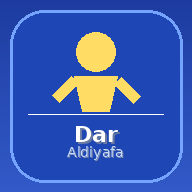

# 🏨 دار الضيافة بالمنصورة
## Dar Al Diyafa Mansoura - Hotel Management System

<div align="center">
  
  
  
  
  
  
</div>

---

نظام إدارة فندقي متكامل وعصري بتقنية PWA مع دعم العمل بدون إنترنت.

## ✨ المميزات

- 🏠 **إدارة الغرف** - إضافة، تعديل، حذف، تغيير الحالة
- 💎 **غرف VIP** - تأثيرات ذهبية مضيئة خاصة
- 👥 **إدارة الضيوف** - بيانات كاملة وسجل إقامة
- 📊 **لوحة مالية** - إيرادات يومية/شهرية/سنوية
- 🔍 **بحث متقدم** - بالاسم أو الرقم أو الهاتف
- 🧾 **فواتير** - طباعة وتصدير PDF وواتساب
- 📋 **سجل النشاط** - تتبع كل العمليات
- 👨‍💼 **إدارة الموظفين** - صلاحيات متعددة
- 📴 **وضع بدون إنترنت** - يعمل بالكامل Offline
- 📱 **PWA** - قابل للتثبيت على Android و iPhone
## 📁 هيكل المشروع

```
dar-aldiyafa/
├── index.html          ← الصفحة الرئيسية
├── style.css           ← التصميم والأنيميشن
├── firebase.js         ← كود التطبيق + Firebase
├── service-worker.js   ← الـ PWA والـ Offline
├── manifest.json       ← إعدادات التطبيق
├── README.md           ← هذا الملف
└── assets/
    ├── icon-72.png
    ├── icon-96.png
    ├── icon-128.png
    ├── icon-144.png
    ├── icon-152.png
    ├── icon-192.png
    ├── icon-384.png
    └── icon-512.png
```

## 📱 تثبيت كتطبيق

- **Android**: افتح الموقع في Chrome ← اضغط "إضافة للشاشة الرئيسية"
- **iPhone**: افتح في Safari ← اضغط Share ← "Add to Home Screen"

---

**💻 Programming & Developed With ❤️ By Engineer Mohamed Hammad**

[](https://www.facebook.com/en.mohamed.nasr)
